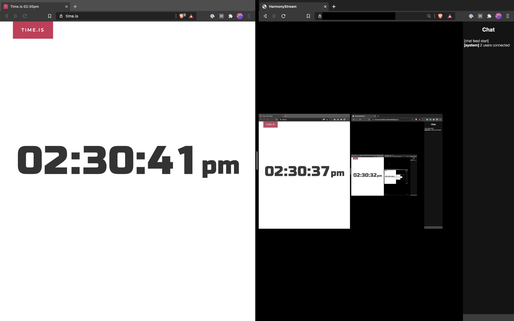
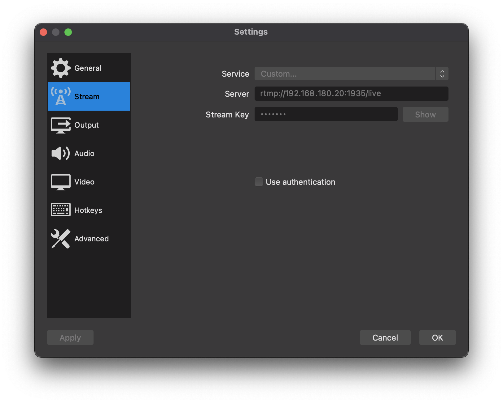

# HarmonyStream

HarmonyStream is a self hosted live streaming platform providing glass to glass latency as low as 4-5 seconds.

Note: the version of HarmonyStream in the the latency example is not necessarily up to date.


## Default OBS Configuration
By default the RTMP server running through ffmpeg is configured to listen with the following configuration:
```
port: 1935
stream: rtmp://0.0.0.0:1935/live
stream key: default 
```



## Deploying With Docker
Example with `docker run`
```sh
docker run -p 5000:5000 -p 1935:1935 lastpenguin/harmony-live-stream
```

Example docker-compose.yml
```yaml
...
  harmonystream:
    image: lastpenguin/harmony-live-stream
    container_name: harmonystream
    restart: always
    ports:
      - 5000:5000 # web server
      - 1935:1935 # rtmp ingest
    volumes:
      - "<transcode tmp>:/tmp/harmonystream"
```

## Reverse Proxy Support

Note: when using with a reverse proxy disable gzip / response compression. This can affect the size of the chunks used when buffering responses and can increase video latency / cause unexpected buffering.

